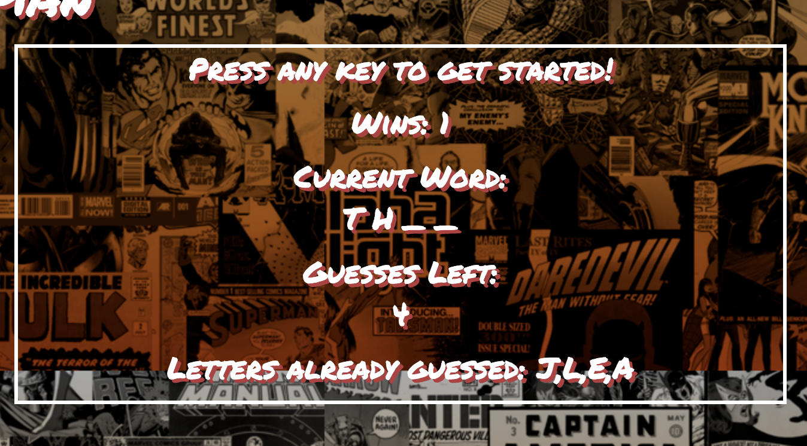

# JavaScript - The Language of the Web

### Overview

In this project I created an app that features the popular game Hangman. The app will run in the browser, and feature dynamically updated HTML powered by JavaScript code. I was able to complete this project after a week of learning JavaScript. 

### Given Guidelines for the Project

1. Choose a theme for your game!
2. Use key events to listen for the letters that your players will type.
3. Display the following on the page:
    * Press any key to get started!
    * Wins
    * Number of Guesses Remaining:
    *Letters Already Guessed
4. After the user wins/loses, the game should automatically choose another word and make the user play it

### Screenshots

The following screenshots demonstrate the essence of the game. 

* You will notice there is a section for wins, the current word, guesses left, and letters already guessed.

* If a word is guessed, you will see the word across the page

